

# 🦩 Flamingo's Lake

**Offensive Security Researcher | Tooling Developer | Lab Builder**

*Researching Advanced Adversarial Tradecraft*

Offensive security researcher specializing in tooling, exploit development, and advanced Active Directory tradecraft. 

I focus on Windows internals, evasive tradecraft, offensive engineering and building tools that work in mature enterprise environments.

I’m currently focusing on learning Windows driver exploitation and related low-level security topics. Feel free to connect or reach out.

## 🎯 Certifications

<table align="center" style="margin: 0 auto;">
  <tr>
    <td align="center" width="140">
      <a href="https://www.credential.net/95ef76c2-fb20-4f3e-b381-a25817cc7159">
        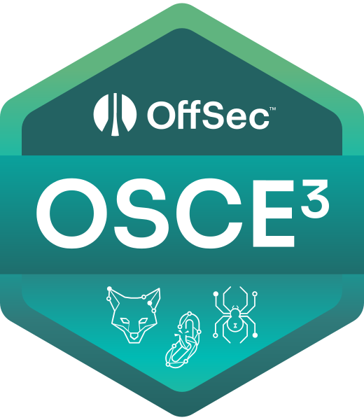
      </a>
       <b>OSCE3</b>
    </td>
    <td align="center" width="140">
      <a href="https://www.credential.net/1fca13b6-7f0c-4b62-9345-aa7cbe2f2801">
        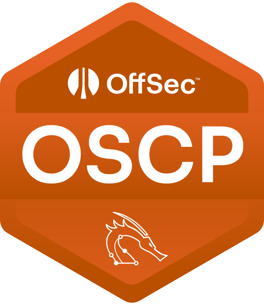
      </a>
       OSCP
    </td>
    <td align="center" width="140">
      <a href="https://www.credential.net/3a226616-b046-49fa-93ab-a14d4b888312">
        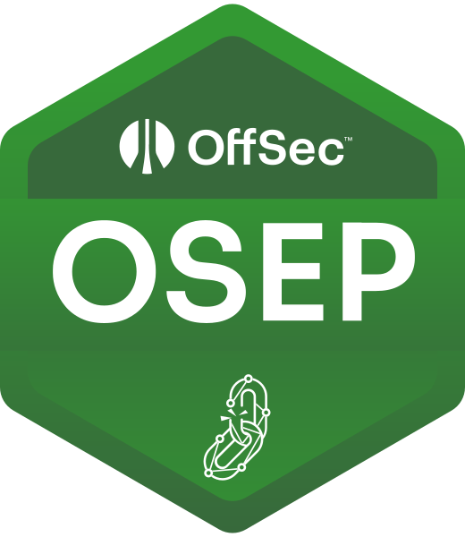
      </a>
       OSEP
    </td>
    <td align="center" width="140">
      <a href="https://www.credential.net/977f6199-763b-4f3c-b3a2-788d06c1101a">
        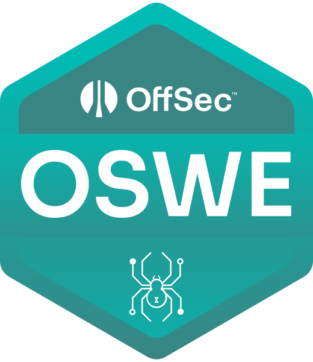
      </a>
       OSWE
    </td>
  </tr>
  <tr>
    <td align="center" width="140">
      <a href="https://www.credential.net/cffd5b53-47fa-4929-bab3-c4e7c88cd954">
        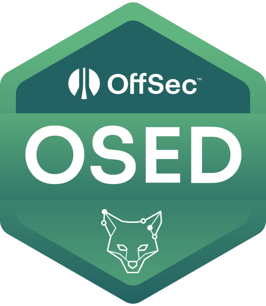
      </a>
       OSED
    </td>
    <td align="center" width="140">
      <a href="https://eu.badgr.com/public/assertions/Lw_4MYnwSGextGzpME4KRQ">
        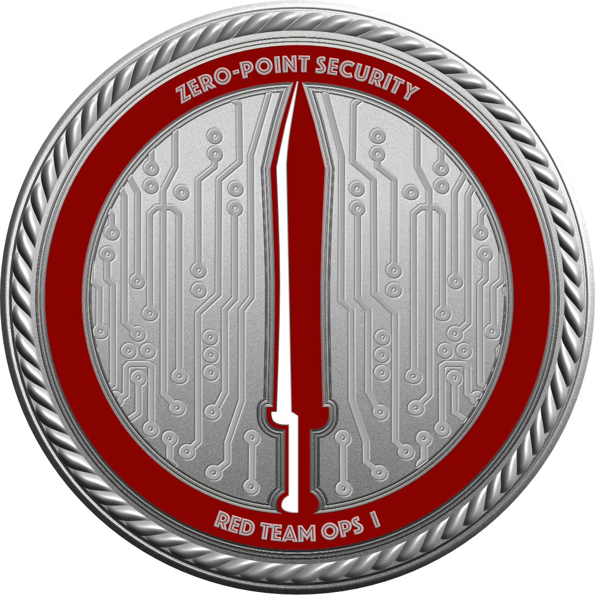
      </a>
       CRTO
    </td>
    <td align="center" width="140">
      <a href="https://www.credential.net/d95a945e-f66c-4cc6-8337-53a4b2cf0b5d">
        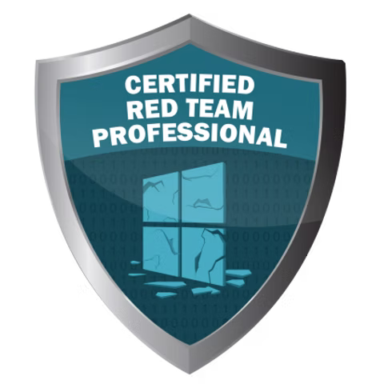
      </a>
       CRTP
    </td>
    <td align="center" width="140">
      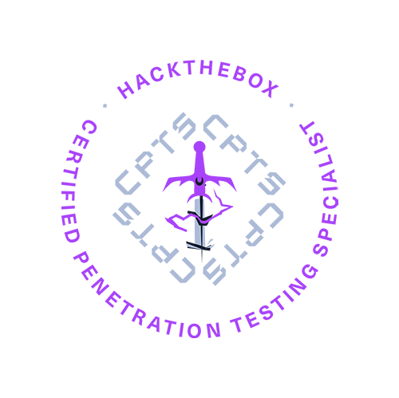
       CPTS
    </td>
  </tr>
</table>

## 🔧 Featured Projects

| Project | Description |
|---------|-------------|
| [**CDPeek**](https://github.com/deathflamingo/CDPeek) | Post-exploitation browser surveillance toolkit leveraging Chrome DevTools Protocol for real-time HTTP/HTTPS interception, credential harvesting, and HttpOnly cookie extraction |
| [**CDP-Enabler**](https://github.com/deathflamingo/CDP-Enabler) | DLL injection tool using signature-based symbol resolution to enable CDP debugging on running Edge processes without browser restart |
| [**CTwobe**](https://github.com/deathflamingo/CTwobe) | Covert channel C2 exploiting YouTube's infrastructure as command transport, achieving ~120 QR codes/sec despite H.264 re-encoding |
| [**Nopfuscator**](https://github.com/deathflamingo/nopfuscator) | x86/x64 shellcode obfuscation tool that disassembles payloads and injects randomized NOP-equivalent instructions to evade signature detection |

## 💻 Tech Stack

<table align="center" style="margin: 0 auto;">
  <tr>
    <td align="center" width="96">
      
       C
    </td>
    <td align="center" width="96">
      
       C++
    </td>
    <td align="center" width="96">
      
       C#
    </td>
    <td align="center" width="96">
      
       Python
    </td>
    <td align="center" width="96">
      
       PowerShell
    </td>
    <td align="center" width="96">
      
       Bash
    </td>
  </tr>
</table>

### Tools & Platforms

<table align="center" style="margin: 0 auto;">
  <tr>
    <td align="center" width="96">
      
       Linux
    </td>
    <td align="center" width="96">
      
       Windows
    </td>
    <td align="center" width="96">
      
       Azure
    </td>
    <td align="center" width="96">
      
       AWS
    </td>
    <td align="center" width="96">
      
       Docker
    </td>
    <td align="center" width="96">
      
       Git
    </td>
  </tr>
  <tr>
    <td align="center" width="96">
      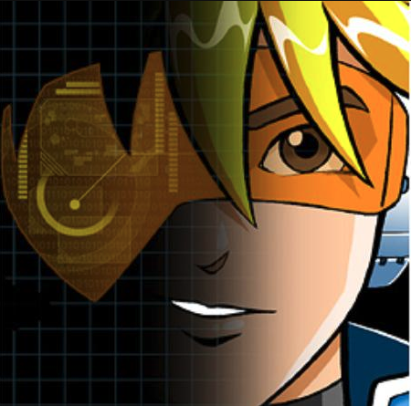
       Cobalt Strike
    </td>
    <td align="center" width="96">
      
       Metasploit
    </td>
    <td align="center" width="96">
      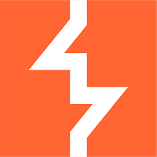
       Burp Suite
    </td>
    <td align="center" width="96">
      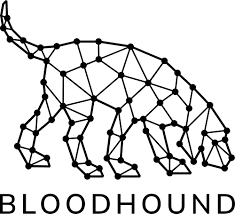
       BloodHound
    </td>
    <td align="center" width="96">
      
       Binary Ninja
    </td>
    <td align="center" width="96">
      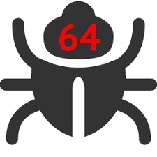
       x64dbg
    </td>
  </tr>
</table>

## 📫 Get in Touch

- 🌐 **Blog:** [deathflamingo.com](https://deathflamingo.com)
- 💬 **Discord:** `deathflamingo`
- 💼 **LinkedIn:** [Aditya Bakshi](https://www.linkedin.com/in/aditya-bakshi-26046a1bb/)
- 📧 **Email:** adityabakshi13 [at] gmail [dot] com

